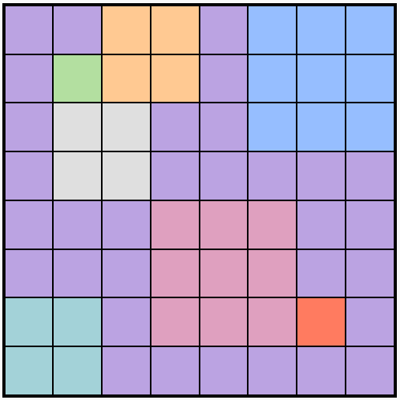
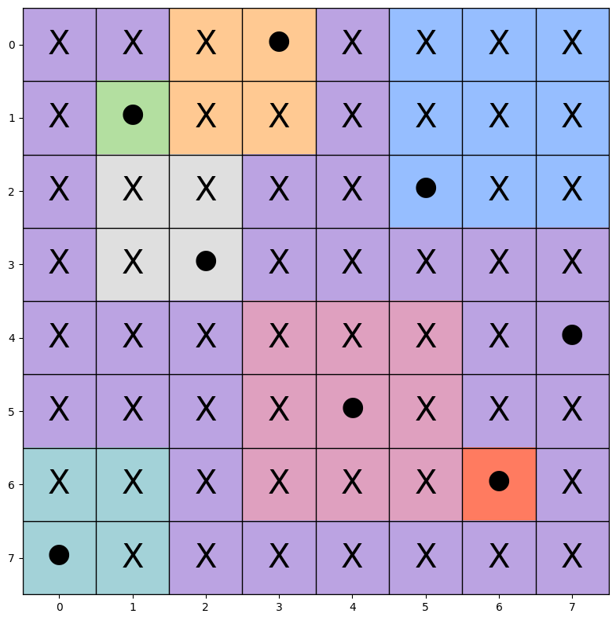

# 👑 LinkedIn Queens Solver

This project is an automated solver for the popular logic game **"Queens"** on LinkedIn.

Starting from a simple screenshot of the game board, the script uses **Computer Vision** techniques to extract the grid and colors, and a **Logic Engine with Backtracking** to find the correct solution. The result is an automatically saved image showing the solved puzzle.

## 📸 Example

Here is how the script processes a level. By providing the input screenshot on the left, it generates the solved image on the right:

| Original Board | Solved Board |
| :---: | :---: |
|  |  |

> **Note:** The example images are located in the `data/` directory.

## ⚙️ How does it work?

The program is divided into two main modules:
1. **Computer Vision (OpenCV)**: Processes the image, detects the grid (bounding box), calculates the number of cells, and maps each cell by assigning a numerical identifier based on its color.
2. **Resolution Engine (Constraint Satisfaction)**: Implements human-like logic to exclude invalid cells (marking them with an "X"). If logical deduction reaches a stalemate, the algorithm switches to a *Brute Force / Backtracking* approach to explore the remaining options and guarantee the correct solution.

The implemented game rules are:
* Exactly one queen per row.
* Exactly one queen per column.
* Exactly one queen per color region.
* Queens cannot touch each other (not even diagonally).

## 🚀 Requirements and Installation

The project is written in Python 3. Ensure you have the following libraries installed:

```bash
pip install opencv-python numpy matplotlib scikit-learn
```

## 💻 Usage

To solve a level, run the script from the terminal, passing the image path as an argument.

```bash
python3 queen_solver.py data/77.png
```

The program will read the image, find the solution, and save a new image named `77_solved.png` in the same folder as the original file.

## 🤝 Contributing
Feel free to open *Issues* or *Pull Requests* to improve the color extraction algorithm or the solver's overall efficiency!